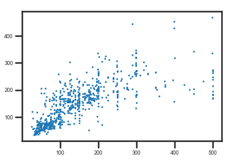
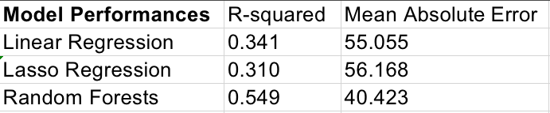
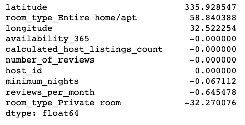
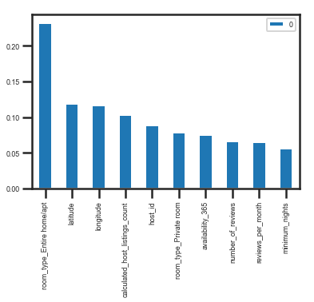
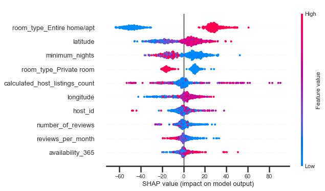
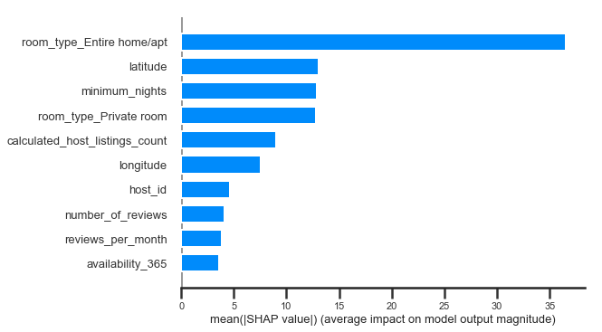

# Boston_Airbnb_EDA

## Project Motivation
For this demo, I have used the open data source compiled by Inside Airbnb on 10 June 2020 to analyze Boston Airbnb Dataset by performing EDA based on three criteria's - a) Location - What regions do you have more choice or are more likely to stay in Boston Airbnb?; b) Room Type - What types of rooms are most popular for stay?; c) Price - What are the important features to influence the price? Could you predict the price of Boston Airbnb?

## Boston Airbnb Dataset
Consists of 3440 listings and 16 features of Airbnb across 25 neighborhoods of Boston.

## EDA

### Reviewing paired relations among nine numerical features
**Latitude:** From South 42.25 to North 42.40, the number of listings are increasing.

**Longitude:** From West -71.15 to East -71.00, the number of listings for Boston Airbnb increases.

**The Number_of_Reviews and Reviews_Per_Month** are positively correlated.

### Reviewing Spearman correlation heatmap to find any correlation among nine numerical features
**Latitude** is positively correlated with price(r=0.31) and longitude(r=0.30).

**The number of reviews and review per month** are positively correlated(r=0.44).

**Availability 365 and calculated host listings count** are positively correlated(r=0.25).

### Location - What regions do you have more choices or will you more likely to stay in Boston Airbnb?

The number of listings of Airbnb across 25 Neighborhoods in Boston.

Top five neighborhood locations in Boston that are likely to have higher chance of us finding Airbnb.

Remarkably, Dorchester has an easily higher proportion of Airbnb compared to other neighborhoods, at 12%.

The distribution of Airbnb across Boston, the brightest are has the highest amount of Airbnb.

### Room Type - What types of rooms are most popular to stay?

Entire home/apt and Private room are among the available choices while considering the number of listings.

There about 425 Airbnb Listing available in all 365 days/

Travelers tend to stay longer in shared rooms than in private rooms and entire home/apt.

Private room and Entire home/apt have a higher average number of reviews than Shared rooms and Hotel rooms.

Entire home/apt is one of the popular choices to consider in terms of availability majority of the time as Private and Shared rooms have lesser availability.

After dealing with outliers and removing of rows with price above $500, excluding minor room types, we've a spearman heat correlation of 11 features.

### Price - What are the important features to influence price? Could you predict the price of Boston Airbnb?

 The average price by private room is about $81.22, while the average price by the entire home/apt is much higher at about $189.38.

Meanwhile I found the average price by private room is about $81.22, while the average price by the entire home or apartment is much higher at about $189.38.

The actual avg price for Boston Airbnb from the test dataset is about $147.85. The predicted avg price for Boston Airbnb from the test dataset is about $149.53.

R-squared at 0.549 indicates that the Random Forest model best explains the variability of the response data. The mean absolute error at 40,423 indicates that the Random Forest model has a lower absolute difference between prediction and actual observation, which means it has lower prediction errors.

From the above coefficients of regression model, we can see as the variable latitude, room type entire home/apt, and longitude increases, the response variable price will increase and reversly, the increase of room type private rooms will lead to decrease in the price. The results of the coefficients definitely give the picture that location and room type are important influencers for the prices.

The feature importance ranking plot from the Random Forest model shoes that room type entire home/apt, latitude and longitude are still the most important features to predict the price, and interestingly, calculated host listings count and host id are also other two important influencers in Random Forests.

The Shapley value plot can further show the positive and negative relationships of the predictors with the response variable price - 

    <ul>
        <li>Feature Importance - Variables are ranked in descending order.</li>
        <li>Impact - The horizontal location shows whether the effect of that value is associated with higher or lower prediction.</li>
        <li>Original Value - Color shows whether that variable is high(in red) or low(in blue) for that observation.</li>
        <li>Correlation - A high level of the room type "Entire home/apt" content has a high and positive impact on the price. The "high" comes from the red color, and the "positive" impact is shown on the X-axis. Similarly, "minimum nights" is negatively correlated with target variable price.</li>
     </ul>

Simpler version of Shapley Value indicating the average impact of each variable on the model's output price in descending order and ignoring positive/negative prediction for the price.

## Valuable Insights
<ul>
    <li>Location: What regions do you have more choices or you more likely to stay in Boston Airbnb? - Top five neighborhoods for you to make decisions are Dorchester, Downtown, Jamaica Plain, Roxbury, and Back Bay.</li>
    <li>Room Type: What types of rooms are most popular for stay? - Generally speaking, you would have higher chance to find your Airbnb within the room type Entire home/apt and Private room. While comparing between the two, Entire home/apt has higher number of listings and average number of reviews per month, on the other hand, Private room has higher number in terms of average minimum nights, the average number of reviews, and average days of availability in 365 days.</li>
    <li>Price: What are the important features to influence price? Could you predict the price of Boston Airbnb? - Lasso Regression and Random Forest both agree that Location(Longitude & Latitude) and Room Type(Entire home/apt & Private room) are important to predict prices of Boston Airbnb. However, if you care about the price, you might choose a Private room for your next trip. Otherwise, from Southwest to Northeast, the price of Boston Airbnb tends to increase.</li>
</ul>
