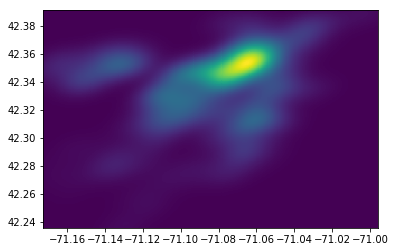

# Boston_Airbnb_EDA

## Project Motivation
For this demo, I have used the open data source compiled by Inside Airbnb on 10 June 2020 to analyze Boston Airbnb Dataset by performing EDA based on three criteria's - a) Location - What regions do you have more choice or are more likely to stay in Boston Airbnb?; b) Room Type - What types of rooms are most popular for stay?; c) Price - What are the important features to influence the price? Could you predict the price of Boston Airbnb?

## Boston Airbnb Dataset
Consists of 3440 listings and 16 features of Airbnb across 25 neighborhoods of Boston.

## EDA

### Reviewing paired relations among nine numerical features
**Latitude:** From South 42.25 to North 42.40, the number of listings are increasing.
**Longitude:** From West -71.15 to East -71.00, the number of listings for Boston Airbnb increases.
**The Number_of_Reviews and Reviews_Per_Month** are positively correlated.

### Reviewing Spearman correlation heatmap to find any correlation among nine numerical features
**Latitude** is positively correlated with price(r=0.31) and longitude(r=0.30).
**The number of reviews and review per month** are positively correlated(r=0.44).
**Availability 365 and calculated host listings count** are positively correlated(r=0.25).

### Location - What regions do you have more choices or will you more likely to stay in Boston Airbnb?

The number of listings of Airbnb across 25 Neighborhoods in Boston.

Top five neighborhood locations in Boston that are likely to have higher chance of us finding Airbnb.

Remarkably, Dorchester has an easily higher proportion of Airbnb compared to other neighborhoods, at 12%.

The distribution of Airbnb across Boston, the brightest are has the highest amount of Airbnb.

### Room Type - What types of rooms are most popular to stay?

Entire home/apt and Private room are among the available choices while considering the number of listings.

There about 425 Airbnb Listing available in all 365 days/

Travelers tend to stay longer in shared rooms than in private rooms and entire home/apt.

Private room and Entire home/apt have a higher average number of reviews than Shared rooms and Hotel rooms.

Entire home/apt is one of the popular choices to consider in terms of availability majority of the time as Private and Shared rooms have lesser availability.

After dealing with outliers and removing of rows with price above $500, excluding minor room types, we've a spearman heat correlation of 11 features.

### Price - What are the important features to influence price? Could you predict the price of Boston Airbnb?

 The average price by private room is about $81.22, while the average price by the entire home/apt is much higher at about $189.38.

